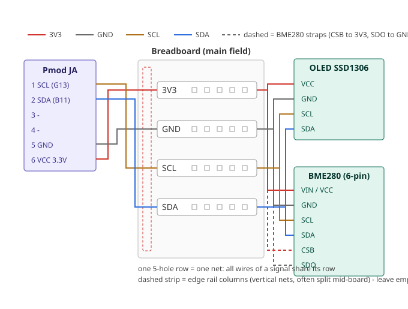

# Peripherals — All External Hardware: Wiring, Drivers, Evidence

*One doc for every external device: the v1.1 production set (WiFi, camera,
mic, speaker, PSRAM) in §1-§7, and the already-purchased batch-1 "toy"
set (LCD, BME280, OLED) in §8 (absorbed from the former TOY_INTERFACING.md).*

**Doctrine check (Rule 0):** every feature on this page runs on the fabricated
chip. The architecture is *external-first*: the silicon gained only three
small additions (UART2, an SPI RX register, wider GPIO); everything heavy —
radio, TCP/IP, frame storage, clip storage — lives in external parts on the
carrier board, exactly like production embedded systems are built.

```
                          ┌──────────────────────────── carrier board ───┐
   ┌──── our chip ─────┐  │                                              │
   │ FreeRTOS, 8 KiB   │  │  ESP32  ── WiFi + TCP/IP (AT firmware)       │
   │ SRAM, XIP flash   │──┼─ UART2                                       │
   │                   │  │  APS6404 ── 8 MB PSRAM   (bulk data)         │
   │ SPI host ─────────┼──┼─ shared SPI bus + MCP3202 ── mic ADC         │
   │ I2C ──────────────┼──┼─ BME280 · SSD1306 · OV7670 SCCB              │
   │ GPIO[15:8] in ────┼──┼─ OV7670-FIFO camera data bus                 │
   │ GPIO[12:8] out ───┼──┼─ CS lines + camera FIFO control              │
   │ PWM ch3 ──────────┼──┼─ PAM8302 amp ── speaker                      │
   └───────────────────┘  └──────────────────────────────────────────────┘
```

## 1. What the silicon gained (v1.1 spec additions)

| Addition | Cost | Why |
|---|---|---|
| **UART2** @ `0x4000_0700` | ~1.5 kGE, +2 pins | The ESP32 companion link = the chip's entire WiFi/internet story |
| **SPI RX register** @ SPI+0x8 | ~30 flops, 0 pins | The SPI host could transmit only; PSRAM/ADC reads need receive |
| **GPIO 16/16** (was 8/8) | ~trivial gates | gp_o[12:8] = CS + camera control, gp_i[15:8] = camera data bus |

Total ≈ +2 kGE on the ~44 kGE budget; utilization ~76% → ~78%. Registers:
UART2 mirrors UART1 (RX +0, TX +4, STATUS +8). SPI RX returns
`{seq[15:8], byte[7:0]}` — byte is the receive shift register (stable once
the bus idles), seq counts byte boundaries.

### Pin budget (Caravel: 38 user pads)

UART1 2 · UART2 2 · JTAG 4 (TRST tied high) · XIP-SPI 4 · SPI host 3 +
CS×2 in gp_o · I2C 2 · PWM 2 (status RGB + SPKR) · gp_o 12 (4 display ctrl,
2 status LED, 2 CS, 3 camera ctrl, 1 spare) · gp_i 8 (camera bus) =
**37 of 38**. One pad spare — flagged for team review at pin-plan freeze.
(On the Arty, the same signals map to Pmods JB/JC, with the shared SPI
MISO return on Pmod JA3 — see `pins_artya7.xdc`.)

## 2. External memory: the PSRAM (the enabler for everything below)

**8 MB SPI PSRAM (APS6404-class, ~₹200)** on the shared SPI host bus,
CS = gp_o[8]. Desk-vs-warehouse rule: the 8 KiB SRAM is the CPU's desk
(stacks, RTOS state); the PSRAM is a warehouse reached by bus commands
(0x02 write / 0x03 read, 24-bit address, auto-increment) — bulk storage,
**never** CPU-executable/stack memory, which is also why Zephyr remains
impossible on v1 and lives in [ASIC_SPEC.md sec. 10](ASIC_SPEC.md) under v2.

Suggested layout (`drivers/psram.h`): camera frames @0x100000, audio clips
@0x200000, network buffers @0x300000. Effective driver throughput at the
5 MHz SPI host: ~250–500 KB/s — a QVGA frame moves in well under a second.

## 3. Capability contract (honest ceilings, per ASIC_SPEC §9)

| Feature | Delivered by | Ceiling |
|---|---|---|
| WiFi + internet | ESP32 over UART2 (AT commands; ESP32 owns TCP/IP) | Full internet access at UART speeds; join/HTTP/MQTT all via `esp_at_cmd()` |
| Camera | OV7670 **FIFO version** (384 KB buffer on module) → GPIO readout → PSRAM → upload via ESP32 | **Snapshots** (~1 QVGA frame / 1–2 s), never video |
| Speaker | PWM ch3 → PAM8302 amp | Tones, alerts, 8-bit clips from PSRAM — not hi-fi |
| Mic | MAX9814 preamp → MCP3202 SPI ADC | Level/event detection; clip capture to PSRAM; tick-paced rates until the mtime pacer lands (hw bring-up item) |
| Voice-AI loop | record → PSRAM → ESP32 → cloud AI → PSRAM → play | ~10 s round trip; the heavy AI stays in the cloud |

## 4. Software (FreeRTOS, `sw/freertos/drivers/`)

| Driver | Covers | Validated by |
|---|---|---|
| `spi_bus.c` | Bus mutex + atomic GPIO RMW + RX-paced byte primitives | all SPI tbs |
| `psram.c` | write/read/selftest | tb_psram |
| `esp_at.c` | AT client: `cmd/ping/join/send_raw`(from PSRAM) | tb_wifi |
| `audio.c` | mic sample/record-to-PSRAM/play-from-PSRAM/beep | tb_audio |
| `camera.c` | SCCB init (via existing I2C), capture arm, FIFO→PSRAM | tb_cam |
| `i2c.c` `st7735.c` `bme280.c` `ssd1306.c` | the toy-test parts already purchased | tb_i2c, tb_lcd |

Shared-bus rule: **every** SPI session takes `spi_bus_lock()`; **every** GPIO
OUT change goes through `gpio_out_update()` (critical-section RMW) — LEDs,
display, CS lines and camera strobes all share one register.

## 5. Simulation evidence (models in `dv/xsim/periph_models.sv`)

| Bench | Models used | Proves |
|---|---|---|
| tb_psram | spi_psram_model | write+readback through the new RX register |
| tb_wifi | esp32_at_model | UART2 both directions, AT→OK round trip |
| tb_audio | mcp3202_model | ADC sample ramp + speaker PWM activity |
| tb_cam | ov7670_fifo_model | RRST/RCLK handshake, RAW GPIO byte reads, checksum |

Results live in [BRINGUP_TEST_REPORT.md](BRINGUP_TEST_REPORT.md). The SPI
models follow the sampled-edge discipline that caught real bugs in tb_lcd and
tb_i2c (never sample and change on the same edge), and every model is checked
by `ibex_soc.sh lint` as its own top under `-Wall`: the PSRAM model's
`mem[addr_q % MEM_BYTES]` mixed a 24-bit address with an `int` byte count
(WIDTHEXPAND), harmless here but fatal under the upstream FuseSoC sim target,
which does not pass `-Wno-fatal` (gotcha 36).

## 6. Bill of materials (documentation only — nothing ordered yet)

Already purchased (arriving via Amazon — §8 below):
ST7735 LCD, BME280, SSD1306, jumpers, breadboard, logic analyzer, soldering
kit, DT830 multimeter (~₹4,550).

To add for the production peripherals (~₹1,800):

| Part | Role | Est. |
|---|---|---|
| ESP32 DevKit (WROOM-32, AT firmware) | WiFi + TCP/IP companion | ~₹500 |
| APS6404 / ESP-PSRAM64H 8 MB SPI PSRAM (SOP-8 on breakout) | external memory | ~₹200 |
| **OV7670 with AL422 FIFO** (must be the FIFO version) | camera | ~₹500 |
| MCP3202 (DIP-8) + MAX9814 mic module | mic ADC + preamp | ~₹300 |
| PAM8302 amp + 4 Ω 3 W speaker | speaker | ~₹250 |

## 7. Hardware bring-up items (recorded now, executed when parts land)

1. PSRAM SO and ADC DOUT share the SPI_RX line — both tri-state when
   deselected; add 10 k pull-ups on both CS lines (reset-window cover).
2. Camera WEN/VSYNC framing needs the real sensor's timing (model is
   simplified by design); SCCB probe (`cam_init`, PID=0x76) is the smoke test.
3. mtime-paced audio sampling (true 8 kHz) replaces tick pacing.
4. ESP32 first contact at its 115200 default; keep `esp_at_ping()` as step 1.

## 8. Batch-1 "toy" hardware (purchased, ~₹4,550 — the Phase-2 test set)

ST7735 1.8" SPI LCD (pre-soldered) · BME280 I2C sensor · SSD1306 OLED ·
jumpers · breadboard · 24 MHz logic analyzer · DT830 multimeter · soldering
kit (BME280 + OLED need ~10 header joints — ask for guidance before starting).

Firmware: `ibex_soc.bat` → **Flash to Board** — nothing to select. Since
2026-08-18 there is ONE hardware image and the LCD/sensor task is always in
it. What each part adds when wired (2026-08-19 firmware):

| Wired | You get |
|---|---|
| ST7735 LCD | live system-status screen (Phase 2a below) |
| + BME280 | `T= 25.34C H= 45.6%` joins the LCD live block; a `T=...cC P=...Pa H=...m%` console line every 10 s (silenced together with the heartbeat by `t`). Temperature is signed — below zero prints `-` correctly. |
| + SSD1306 | a **second, independent status screen**: double-height `ARF` logo + `minimal-ibex / SoC GF180MCU` identity, a rule, then live uptime + spinner, pattern/speed/last-key, rgb/heartbeat, a sensor row, and a sweeping activity bar. It updates every second **with or without a sensor** — with a BME280 fitted the bar row becomes the pressure readout |

Un-wired parts show `--` and cost nothing. **Every absent part is
re-probed every 5 s**, so you can wire the I2C parts *after* boot and they
join live (`toy: oled attached` / `toy: bme attached` on the console); a
part that stops answering (loose jumper) is demoted back to `--` after 3
failed cycles (`toy: bme lost`) and picked up again on re-seat.

### How to run a bench session (any phase)

1. Board on USB. `ibex_soc.bat` → **Flash to Board (QSPI)** — builds
   firmware + bitstream and programs the flash (~30 min first time,
   cached after). Press **PROG** on the board when it finishes.
2. Find the COM port (Device Manager → Ports → "USB Serial Port") and
   open PuTTY: Serial, that port, **115200**, 8N1.
3. Expect the boot banner, then drive it: `1-4` LED patterns, `f/m/s`
   speed, `r/g/b/w/a` RGB, `i` re-scans the I2C bus, `t` toggles the periodic reports (heartbeat +
   sensor line). Scripted check: `python util/uart_command_test.py`.
4. Closing the serial port **resets the board** (DTR wired to ck_rst,
   WALKTHROUGH gotcha 27) — it reboots cleanly on reopen; that is not a
   crash.

### Phase 2a — LCD only, no soldering — **PASSED on hardware 2026-08-18**

Status: done (BRINGUP_TEST_REPORT §9 — live status screen up, console
round trip verified). The steps below stay as the recipe for any fresh
board or teammate setup.

The ST7735 ships with its header pre-soldered, so it is the one batch-1
part testable the day it arrives. **Everything you need:** the LCD + 8
jumper wires (female end onto the LCD's pins, male end into the Arty's
sockets). Nothing else to buy — "ChipKit header" and "power header" in the
table below are just names for socket rows **already printed on the Arty
board**: the analog row is labelled A0–A11 on the silkscreen, and the power
row (a few sockets along the same edge) is labelled 3V3 / GND / 5V0 / VIN.

**Test order for the session:**

1. **Phase 1 re-check first, nothing wired** — the full PuTTY console the
   board already passed (the old asm-demo controls, which now live inside
   the FreeRTOS image): `1-4` patterns, `f/m/s` speed, `r/g/b/w/a` RGB on
   all four LEDs, `t` heartbeat, button-hold switch-mirror. This also
   closes the Phase-1 RGB re-check (only LED0 lit last time; fixed).
2. **Power off, wire the LCD** per the table below, double-checking your
   module's silkscreen (pin order varies between ST7735 boards).
3. **Phase 2a**: **Flash to Board** again (any firmware flashed before
   2026-08-18 predates the LCD screen — a wired LCD stays dark on old
   firmware) and watch the screen come up.

**What the LCD shows:** a big orange **ARF** logo, the
`minimal-ibex-soc` title bar, the core/kernel/memory banner, then a live
status block refreshed every second — uptime (with a rotating `|/-\`
"alive" spinner), tick count, LED pattern + speed, last key pressed, RGB
mode, heartbeat state, OLED/BME presence, and temperature + humidity once
a BME280 joins. Keys typed in PuTTY update the screen within a second: that
round trip (UART RX → task state → SPI text render) is itself the test.

*Why it stays smooth:* code executes in place from flash (~500× slower
than SRAM, gotcha 19), so the firmware keeps a shadow copy of the live
block and redraws **only the characters that changed** each second — a
handful of cells, tens of milliseconds. Only the one-time boot draw takes
a moment.

The toy firmware is missing-part tolerant — every I2C wait is bounded, so
the un-wired OLED/BME280 just show as `--` on screen and
`oled=... bme=... (0=ok)` non-zero on UART; nothing hangs.

*If the screen misbehaves*: completely dark → WALKTHROUGH gotcha 25
(usually old firmware); backlight lit white but nothing drawn → gotcha 26
(this was a real SPI-timing RTL bug, fixed 2026-08-18 — `git pull` and
reflash if your bitstream predates it: the fix is in the FPGA logic, so
**rebuilding the bitstream, not just the firmware, is required**).

### ST7735 LCD (SPI) — wiring to the Arty ChipKit analog header

| LCD pin | Signal | FPGA pin | Header label |
|---|---|---|---|
| VCC / GND | 3.3 V / GND | — | power header 3V3 / GND |
| CS | DISP_CTRL[0] | B7 | A6 |
| RESET | DISP_CTRL[1] | B6 | A7 |
| A0 / DC | DISP_CTRL[2] | E6 | A8 |
| SDA / MOSI | SPI_TX | E5 | A9 |
| SCK | SPI_SCK | A4 | A10 |
| LED / BL | DISP_CTRL[3] | A3 | A11 |

Contract: SPI host mode 0, MSB first, 5 MHz; FIFO-empty ≠ shifter idle —
allow ~32 clocks drain before toggling DC. Verify silkscreen before power.

### Phase 2b — BME280 + SSD1306 (I2C) — Pmod JA, shared bus — **OLED PASSED 2026-08-20; BME280 WIP (first module dead, replacement on order)**

**Soldering first (the only soldering in Phase 2, ~10 joints).** Both
modules ship with a loose 4-pin header strip. For each module:

1. Push the header's **short pins** through the module holes from the
   component side, **long pins down**, and stand it in the breadboard so it
   sits square (the breadboard is the jig — nothing to hold).
2. Iron at ~350 °C, small tip. Touch pad + pin together for ~1 s, feed in
   a little solder, pull the solder away, then the iron. 2–3 s per joint.
3. A good joint is a small shiny cone wetting both pad and pin. A ball
   sitting on top = reheat. A bridge between pads = reheat and drag apart
   (worst case: no harm, the board just won't answer on I2C).
4. Sanity check before power: multimeter continuity pin↔pad, and **no**
   continuity VCC↔GND on the module.

**Wiring (power off).** Both modules share the one I2C bus. Use **four
separate 5-hole junction rows in the breadboard's main field** (one row
per net — NOT the edge rails, see the geometry warning below):



| Net (one breadboard row each) | From Pmod JA | To OLED | To BME280 |
|---|---|---|---|
| 3V3 | pin 6 (VCC) | VCC | VIN/VCC **and CSB** |
| GND | pin 5 (GND) | GND | GND **and SDO** |
| SCL | pin 1 (G13) | SCL | SCL |
| SDA | pin 2 (B11) | SDA | SDA |

The CSB/SDO straps are **required** unless your module demonstrably
straps them on-board: CSB low or floating puts the BME280 in **SPI
mode and it NACKs every I2C address** — exactly the `bme=1`-on-a-
healthy-bus signature (OLED ok, sensor silent at 0x76 AND 0x77). SDO
low = 0x76, high = 0x77 — the firmware probes both.

Pmod JA is the 12-pin socket nearest the ethernet jack; pin 1 is marked on
the silkscreen (square/`JA1`), top row: 1-2-3-4-GND-VCC. Addresses are
fixed and distinct (OLED 0x3C, BME280 0x76 with SDO low — the common
purple breakout ties it), so no configuration is needed. Open-drain with
XDC pull-ups + module pull-ups; OpenCores master at 100 kHz.

**Read each module's silkscreen before wiring — same rule as the LCD.**
4-pin SSD1306 boards ship in *two* pin orders (`VCC-GND-SCL-SDA` and
`GND-VCC-SCL-SDA`) and reversed power kills the module; BME280 breakouts
may label power `VIN`. Wire by the printed name, never by position.

**6-pin BME280 modules (extra CSB + SDO pins).** CSB selects the
interface (high = I2C, low = SPI) and SDO sets the I2C address LSB.
**Treat both straps as required wiring** (CSB → 3.3 V row, SDO → GND
row): "the breakout straps them on-board" is not reliable. An
unstrapped CSB leaves the chip in SPI mode, NACKing every I2C address
(`bme=1`) on a proven-healthy bus — the first thing to check when the
OLED answers and the sensor doesn't (then: the BME's own SCL/SDA
joints, beep-tested module-pin to module-pin through the row). The
firmware probes **both 0x76 and 0x77**, so either SDO level works.

**The boot-time bus scan (first diagnostic to read).** Since 2026-08-20
the firmware prints, *before any device traffic*, every address that
ACKs on a virgin bus:

```
toy: i2c scan: 3C 76        <- both parts alive (OLED 0x3C, BME280 0x76)
toy: i2c scan: 3C           <- only the OLED answers
toy: i2c scan: BUS STUCK (held low)
```

The **`i` console key re-runs it on demand** — the bench workflow is
"rewire a part, press `i`", with no reboot and no reflash. This settles
wiring-vs-part arguments in one line, and it cannot be confounded by
either driver: at boot it runs on the bare bus right after `i2c_init()`. An address that does not appear here is **not on the
bus** — no amount of driver work will find it. The scan aborts at the
first timeout because a held-low bus times out per address, which over
XIP would stall boot for minutes.

**Decoding `oled=X bme=X` (the number is `-rc`):**

| Code | Meaning | Look at |
|---|---|---|
| 0 | ok | — |
| 1 | NACK — bus is healthy, device didn't answer | that module: power orientation, SCL/SDA swap, solder joints, (BME) CSB/SDO straps |
| 2 | TIMEOUT — SCL never completed a clock; the **bus is held low** | shared wiring, both modules: an **unpowered module clamps SCL/SDA low through its ESD diodes** (check VCC/GND rails actually reach the modules), a wire in the wrong Pmod hole (JA pin 5 is GND — SCL there = held low), a solder bridge to GND |
| 3 | (bme only) answered but wrong chip ID — not a BME280 (BMP280 prints this) | the module model |

Both parts failing with the *same* code points at the shared bus, not
the chips: `oled=2 bme=2` = stuck bus (seen on the bench 2026-08-20 —
unplugging SCL/SDA from the Pmod should turn boot codes into `1`s; if
they stay `2`, the fault is board-side).

**Breadboard geometry — the trap that caused the first stuck bus
(2026-08-20, photo-diagnosed):** the long columns along the board's
edges are POWER RAILS — every hole in one column is a single vertical
net (and on modular boards the rail is often **split at the halfway
seam**). Junctions belong in the **main field's horizontal 5-hole
rows** (one row = one net). Bundling several signal wires into the
edge columns shorts them all together — SCL tied to GND/SDA = the
timeout signature above. Correct layout: four separate field rows
(3V3 / GND / SCL / SDA), all wires of a net in its one row, edge rails
unused or power-only.

**Multimeter debug procedure (DT830), for a stuck bus.** Continuity
first, **board unplugged**, meter on the beep/diode range:

1. Each module pin ↔ its breadboard row: beep = solder joint good.
2. Module VCC ↔ GND: must **NOT** beep (beep = solder bridge — reheat).
3. End-to-end: JA pin 1 ↔ module SCL, JA pin 2 ↔ module SDA,
   JA pin 6 ↔ module VCC, JA pin 5 ↔ module GND — all must beep.
4. SCL ↔ GND, SDA ↔ GND, SCL ↔ SDA: must **NOT** beep.

Then voltages, **board powered**, meter on DC 20 V, black probe on JA
pin 5 (GND), red probe **at the module pins** (not the rail):

5. Module VCC: expect ~3.3 V. 0 V = the power never arrives —
   breadboard rails are often **split at the half-way mark**; jumper
   across the gap or move the modules to the powered half.
6. SCL, then SDA: idle bus reads ~3.3 V (pull-ups). **~0 V = the held
   line** — follow that wire to the fault.
7. 6-pin BME280: CSB ~3.3 V (I2C mode) and SDO ~0 V (0x76); an
   unstable/floating reading = strap it (CSB → 3.3 V, SDO → GND).

No reflash needed after fixing: parts hot-attach within 5 s
(`toy: oled attached` / `toy: bme attached` on the console).

**Test.** No reflash needed if the board already runs the 2026-08-19
image — the parts are auto-detected within 5 s of power-up (or even wired
live). Expect on the console at boot:
`toy: lcd up, oled=0 bme=0 (0=ok)` — non-zero means that part didn't
answer: recheck VCC/GND orientation first, then SCL/SDA swap (the classic
miss), then the solder joints. Both parts `ok` + a `T=` line within 10 s =
Phase 2b passed.

### Simulation evidence (2026-08-08, both PASS; models tightened 2026-08-19)

- **tb_lcd 5/5**: full 26-byte init + pixel sequence decoded by a
  behavioural ST7735 model. History: the model originally sampled a
  *delayed* MOSI copy to tolerate the RTL's driving-edge race — which
  masked a real mode-0 hold-time bug until a physical panel exposed it
  (2026-08-18). The RTL is fixed and the models now sample the **raw wire
  at the rising edge** like the datasheet part (CLAUDE.md Rule 1b), so a
  hold-time regression fails in sim, not on a panel.
- **tb_i2c**: full register read through the team's `i2c_slave_bfm` — found
  and fixed a real BFM bug (read path released SDA on rising SCL = phantom
  STOP). The same driver sequence reads the BME280 chip-ID on hardware.
